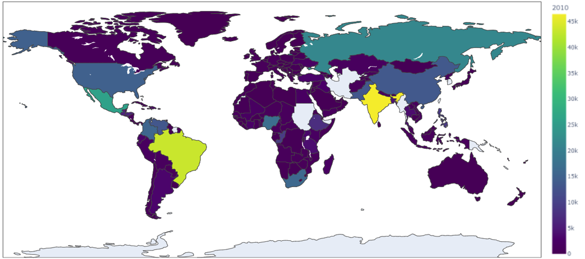

# World Homicide 

### (Data Science Project)

Some graphs about the countries with the highest number of total homicides and countries with highest average of homicides per inhabitant.

You can see the number of murders filtering by region, continent, country, year, etc.

Very handy when planning for your next holidays!

The image shows the number of murders in the world in 2010, but you can filter to different years.

